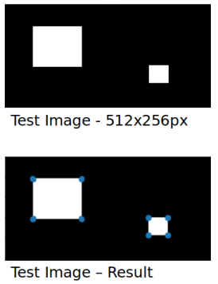

<div class="navbar">
  <div class="navbar-inner">
      <ul class="nav">
          <li><a href="multilinear_interpolation_tensorflow.html">prev</a></li>
          <li><a href="multilinear_interpolation_tensorflow.html">next</a></li>
      </ul>
  </div>
</div>


## Harris Corner Detector - Implementation in PyCUDA

#### A first intruduction to GPU programming


Visit the github repository for the full code.
[](https://github.com/viclule/pycuda_harris_corner_detector)
<br/>
<br/>

The function devides the image in four different parts to process them on different streams.

These are the execution times for the different implementations:
- Python Code -> ≈2.22 seconds
- PyCUDA – single stream -> ≈0.0018 seconds
- PyCUDA – four streams (with concurrency) -> ≈0.0015 seconds

This is the image used to test the code:
<br/>
<br/>
[]
<br/>
<br/>

#### Python code

```python
from string import Template
import pycuda.driver as drv
import pycuda.tools
import pycuda.autoinit
from pycuda.compiler import SourceModule
import numpy as np


def pycuda_multi_kernel(img, k_harris, thresh, executions):
    """
    Finds and returns list of corners
        :param img: grayscale image
        :param k: Harris corner constant. Usually 0.04 - 0.06
        :param thresh: The threshold above which a corner is counted
        :param executions: Number of times to be executed
        :return: corner_list: List with corners
        :return: average_execution_time: Average execution time in seconds
    """
    # jumping some lines ...

    # function template
    func_mod_template = Template("""
    #include<stdio.h>
    #define INDEX(a, b) a*${HEIGHT}+b
    __global__ void corners(
        float *dest,
        float *ixx,
        float *ixy,
        float *iyy,
        int offset,
        float k,
        int threshold) {
        unsigned int idx = threadIdx.x + threadIdx.y*blockDim.y +
                            (blockIdx.x*(blockDim.x*blockDim.y));
        unsigned int a = idx/${HEIGHT};
        unsigned int b = idx%${HEIGHT};
        float sxx = 0;
        float sxy = 0;
        float syy = 0;
        float det = 0;
        float trace = 0;
        float r = 0;
        if ((a >= offset) & (a <= (${WIDTH}-offset - 1)) &
            (b >= offset) & (b <= (${HEIGHT}-offset - 1))) {
            for (int bi = b - offset; bi < b + offset + 1; ++bi) {
                for (int ai = a - offset; ai < a + offset + 1; ++ai) {
                    sxx = sxx + ixx[INDEX(ai, bi)];
                    sxy = sxy + ixy[INDEX(ai, bi)];
                    syy = syy + iyy[INDEX(ai, bi)];
                }
            }
            det = sxx*syy - sxy*sxy;
            trace = sxx + syy;
            r = det - k*(trace*trace);
            if ((r/10) > threshold)
                dest[INDEX(a, b)] = r;
        }
    }
    """)
    # jumping some lines ...

    func_mod = SourceModule(func_mod_template.substitute(HEIGHT=k_height,
                                                         WIDTH=k_width))
    pycuda_corners = func_mod.get_function("corners")
```