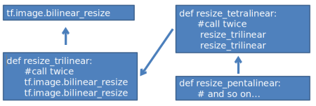
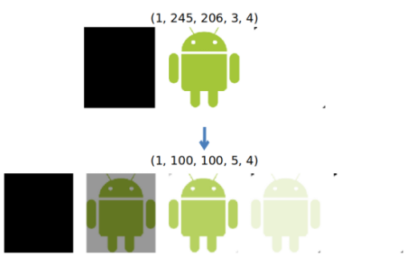

<div class="navbar">
  <div class="navbar-inner">
      <ul class="nav">
          <li><a href="harris_corner_detector.html">prev</a></li>
          <li><a href="harris_corner_detector.html">next</a></li>
      </ul>
  </div>
</div>


## Multilinear Interpolation - Implementation in TensorFlow

#### Extension of the tf.image.resize_bilinear to the N dimensional case


Visit the github repository for the full code.
[](https://github.com/viclule/image_resize_n_linear)
<br/>
<br/>

The function extends the functionality of tf.image.resize_bilinear for N dimensional Tensors.
<br/>
<br/>

#### Strategy
The strategy is fairly simple, tensors are interpolated two dimensions at a time using the already existant tf.image.resize_bilinear function.

[]
<br/>
<br/>

#### Test
1. Building a 3D volume using a black image, an android image and a white image. [1, 245, 206, 3, 4] [1 batch, height, width, depth, 4 channels]

2. Resize the 3D volume to [1, 100, 100, 5, 4]

Expectations: [1, 100, 100, 2, 4] will be half way darker.

Expectations: [1, 100, 100, 4, 4] will be half way brighter.
<br/>
<br/>

This is the image showing the results for the 3D test:
<br/>
<br/>
[]
<br/>
<br/>

#### Python code

```python
import tensorflow as tf


def _resize_by_axis_trilinear(images, size_0, size_1, ax):
    """
    Resize image bilinearly to [size_0, size_1] except axis ax.
        :param image: a tensor 4-D with shape 
                        [batch, d0, d1, d2, channels]
        :param size_0: size 0
        :param size_1: size 1
        :param ax: axis to exclude from the interpolation
    """
    resized_list = []

    # unstack the image in 2d cases
    unstack_list = tf.unstack(images, axis = ax)
    for i in unstack_list:
        # resize bilinearly
        resized_list.append(tf.image.resize_bilinear(i, [size_0, size_1]))
    stack_img = tf.stack(resized_list, axis=ax)

    return stack_img


def resize_trilinear(images, size):
    """
    Resize images to size using trilinear interpolation.
        :param images: A tensor 5-D with shape 
                        [batch, d0, d1, d2, channels]
        :param size: A 1-D int32 Tensor of 3 elements: new_d0, new_d1,
                        new_d2. The new size for the images.
    """
    assert size.shape[0] == 3
    resized = _resize_by_axis_trilinear(images, size[0], size[1], 2)
    resized = _resize_by_axis_trilinear(resized, size[0], size[2], 1)
    return resized


# jumping some lines...


def resize_multilinear_tf(images, size):
    """
    Resize images to size using multilinear interpolation.
        :param images: A tensor with shape 
                        [batch, d0, ..., dn, channels]
        :param size: A 1-D int32 Tensor. The new size for the images.
    """
    if size.shape[0] == 2:
        resized = tf.image.resize_bilinear(images, size)
    elif size.shape[0] == 3:
        resized = resize_trilinear(images, size)
    elif size.shape[0] == 4:
        resized = resize_tetralinear(images, size)
    else:
        raise NotImplementedError('resize_multilinear_tf: dimensions \
                                    higuer than 4 are not supported.')
    return resized
```